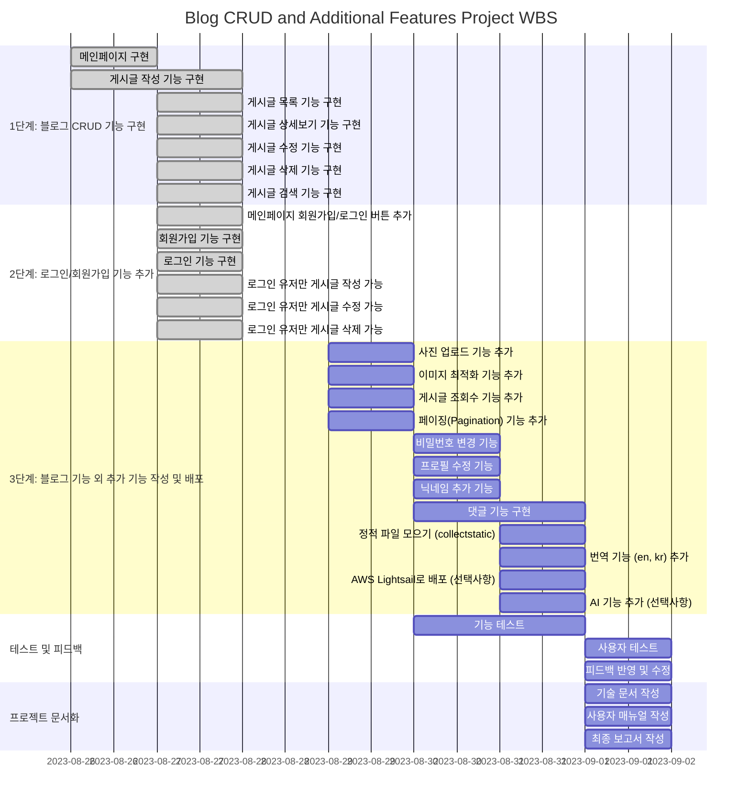
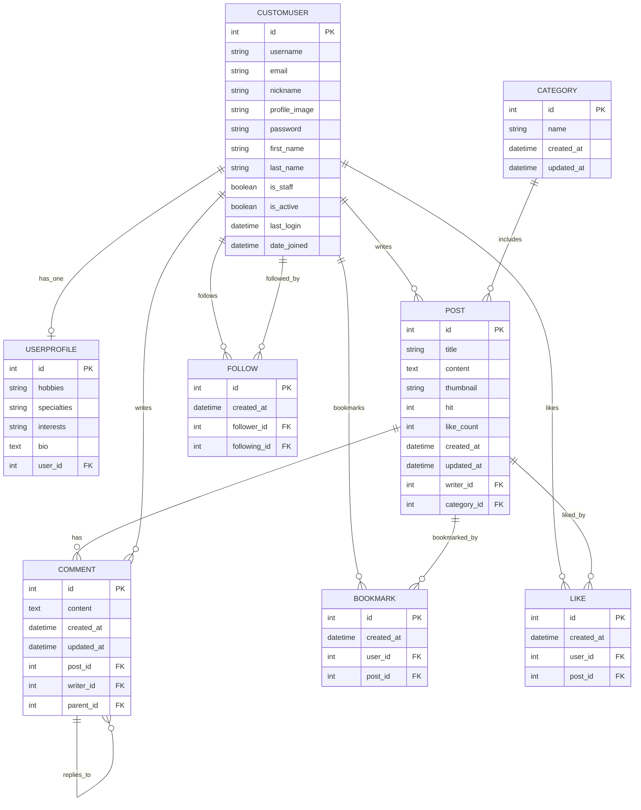

# django_tech_blog
장고 테크 블로그 만들기(ModuBlog)<br/>
프로젝트 기간 : 2024.08.26 ~ 2024.09.01 (7일)<br/>
프로젝트 인원 : 1명<br/>
# 목차
- [1. 프로젝트 개요](#1-프로젝트-개요)
    - [1.1 프로젝트 소개](#11-프로젝트-소개)
    - [1.2 주요 기능](#12-주요-기능)
    - [1.3 기술 스택](#13-기술-스택)
- [2. 개발 환경](#2-개발-환경)
    - [2.1 사용된 버전](#21-사용된-버전)
- [3. 프로젝트 구조와 WBS](#3-프로젝트-구조와-wbs)
    - [3.1 폴더 트리](#31-폴더-트리)
    - [3.2 WBS](#32-wbs)
    - [3.3 ERD](#33-erd)
- [4. 요구 명세](#4-요구-명세)
- [5. 사용 화면 및 주요 기능](#5-사용-화면-및-주요-기능)
    - [5.1 사용 화면](#51-사용-화면)
- [6. URL 구조 및 기능 명세 (Monolithic)](#6-url-구조-및-기능-명세-monolithic)
- [7. 트러블 슈팅 및 해결 방법](#7-트러블-슈팅-및-해결-방법)
- [8. 배운점](#8-배운점)


# 1. 프로젝트 개요
## 1.1 프로젝트 소개

- 주요 목표

    - **블로그 설계 및 구현**: Python과 Django를 기반으로 모놀리식 아키텍처를 설계하고, CBV(Class-Based View)를 활용하여 웹 애플리케이션을 구축
    - **데이터베이스 모델링 및 CRUD 기능 구현**: Django ORM을 통해 데이터베이스를 모델링하고, CRUD(Create, Read, Update, Delete) 기능을 구현하여 데이터를 효율적으로 관리
    - **사용자 인증 및 권한 관리**: 사용자 인증, 권한 관리, 폼 처리 및 유효성 검사를 포함한 웹 보안 기능을 구현하여 실용적인 웹 애플리케이션을 개발
    - **프로젝트 문서화 및 설계**: WBS(Work Breakdown Structure)와 ERD(Entity-Relationship Diagram)를 작성하고, 프로젝트 전반을 문서화하여 개발 프로세스를 체계적으로 관리

## 1.2 주요 기능
- **게시글 관리 기능 (blogs 앱)**

    - **게시글 작성, 수정, 삭제 기능**
    - **게시글 조회, 정렬 및 상세보기 기능**

- **사용자 인증 및 프로필 관리 기능 (accounts 앱)**
    - **회원가입 및 로그인/로그아웃 기능**
    - **프로필 수정 및 비밀번호 변경 기능**

- **검색 및 필터링 기능 (search 앱)**

    - **통합 검색 기능**
    - **특정 조건별 검색 기능 (제목/내용, 작성자, 카테고리 검색)**

## 1.3 기술 스택


# 2. 개발 환경
## 2.1 사용된 버전
- Django : 5.1
- Django Widget Tweaks : 1.5.0
- Model Bakery : 1.19.5
- Pillow : 10.4.0

# 3. 프로젝트 구조와 WBS
## 3.1 폴더 트리
```
📦DJANGO_TECH_BLOG
 ┣ 📦accounts
 ┃ ┣ 📂__pycache__
 ┃ ┣ 📂migrations
 ┃ ┃ ┗ 📜__init__.py
 ┃ ┣ 📜admin.py
 ┃ ┣ 📜apps.py
 ┃ ┣ 📜forms.py
 ┃ ┣ 📜models.py
 ┃ ┣ 📜signals.py
 ┃ ┣ 📜tests.py
 ┃ ┣ 📜urls.py
 ┃ ┗ 📜views.py
 ┣ 📦blogs
 ┃ ┣ 📂__pycache__
 ┃ ┣ 📂migrations
 ┃ ┃ ┗ 📜__init__.py
 ┃ ┣ 📂templatetags
 ┃ ┣ 📜admin.py
 ┃ ┣ 📜apps.py
 ┃ ┣ 📜forms.py
 ┃ ┣ 📜models.py
 ┃ ┣ 📜signals.py
 ┃ ┣ 📜tests.py
 ┃ ┣ 📜urls.py
 ┃ ┗ 📜views.py
 ┣ 📦config
 ┃ ┣ 📂__pycache__
 ┃ ┣ 📜__init__.py
 ┃ ┣ 📜asgi.py
 ┃ ┣ 📜settings.py
 ┃ ┣ 📜urls.py
 ┃ ┗ 📜wsgi.py
 ┣ 📂locale
 ┣ 📂media
 ┣ 📂README_img
 ┣ 📦search
 ┃ ┣ 📂__pycache__
 ┃ ┣ 📂migrations
 ┃ ┃ ┗ 📜__init__.py
 ┃ ┣ 📜admin.py
 ┃ ┣ 📜apps.py
 ┃ ┣ 📜models.py
 ┃ ┣ 📜tests.py
 ┃ ┣ 📜urls.py
 ┃ ┗ 📜views.py
 ┣ 📦static
 ┃ ┣ 📂css
 ┃ ┣ 📂fonts
 ┃ ┣ 📂img
 ┃ ┣ 📂js
 ┃ ┗ 📜logo_dark.png
 ┣ 📦templates
 ┃ ┣ 📂accounts
 ┃ ┣ 📂blogs
 ┃ ┣ 📂layout
 ┃ ┣ 📂partials
 ┃ ┣ 📂search
 ┃ ┣ 📂error
 ┣ 📂tests
 ┣ 📂tools
 ┣ 📜.gitignore
 ┣ 📜.pdm-python
 ┣ 📜.pre-commit-config.yaml
 ┣ 📜db.sqlite3
 ┣ 📜manage.py
 ┣ 📜pdm.lock
 ┣ 📜pyproject.toml
 ┗ 📜README.md
```
# 3.2 WBS

# 3.3 ERD



# 4. 요구 명세
- 메인 페이지 구현
    - 페이지 제목과 "블로그 입장하기" 버튼이 있음.
    - 회원가입/로그인 버튼이 있음.
        - 회원가입 버튼 클릭 시 회원가입 페이지로 이동.
        - 로그인 버튼 클릭 시 로그인 페이지로 이동.

- 회원가입 기능 구현
    - ID와 비밀번호를 입력받아 회원가입이 가능한 페이지 구현.

- 로그인 기능 구현
    - ID와 비밀번호를 입력받아 로그인이 가능한 페이지 구현.

- 게시글 작성 기능 구현
    - 로그인한 유저만 사용 가능
        - 게시글 제목과 내용을 작성하는 페이지 구현.
        - 작성한 게시글은 저장되어 게시글 목록에 표시됨.
        - 카테고리 지정 가능.
        - 사진 업로드 기능
        - 게시글 조회수 증가 기능 포함.
        - 욕설 필터링 기능
- 게시글 목록 기능 구현
    - 모든 사용자들이 게시한 블로그 게시글의 제목을 확인할 수 있음.
    - 페이지네이션 기능
- 게시글 상세보기 기능 구현
    - 게시글의 제목과 내용을 볼 수 있는 기능 구현.
- 게시글 검색 기능 구현
    - 제목과 내용으로 검색 가능.
    - 카테고리에 따라 검색 기능
    - 검색 결과는 시간순, 조회순, 좋아요순으로 정렬 가능.
- 게시글 수정 기능 구현
    - 로그인한 유저만 사용 가능
        - 본인의 게시글만 수정 가능.
        - 게시글 제목 및 내용을 수정하는 페이지 구현.
        - 수정된 내용은 게시글 목록 및 상세보기에 반영됨.
- 게시글 삭제 기능 구현
    - 로그인한 유저만 사용 가능
        - 본인의 게시글만 삭제 가능.
        - 게시글을 삭제하는 기능 구현.
        - 삭제 후 게시글 목록 화면으로 이동.
        - 삭제된 게시글 접근 시 404 페이지 표시 기능.
- 회원 관련 추가 기능 (UI 구현 필요)
    - 비밀번호 변경 기능
    - 프로필 수정 기능
    - 닉네임 추가 기능
- 댓글 기능 (UI 구현 필요)
    - 댓글 추가 기능.
    - 댓글 삭제 기능.
    - 대댓글 기능.
    - 댓글 수정 기능.


# 5. 사용 화면 및 주요 기능
## 5.1 사용 화면
<table border="1" style="width:100%;">
  <colgroup>
    <col style="width: 33%;">
    <col style="width: 33%;">
    <col style="width: 33%;">
  </colgroup>
    <tbody>
        <tr>
            <td>첫 화면</td>
            <td>로그인</td>
            <td>회원 가입</td>
        </tr>
        <tr>
            <td>
		        
            </td>
            <td>
                
            </td>
                       <td>
                
            </td>
        </tr>
                <tr>
            <td>메인 화면</td>
            <td>게시글 상세 화면</td>
            <td>게시글 생성 / 수정</td>
        </tr>
        <tr>
            <td>
		        
            </td>
            <td>
                
            </td>
                       <td>
                
            </td>
        </tr>
                <tr>
            <td>북마크 화면</td>
            <td>검색 화면</td>
            <td>유저 프로필</td>
        </tr>
        <tr>
            <td>
		        
            </td>
            <td>
                
            </td>
                       <td>
                
            </td>
        </tr>
    </tbody>
</table>


# 6. URL 구조 및 기능 명세 (Monolithic)
## 6.1 config
| URL 패턴         | 연결된 URL 설정                   | 연결된 Template        | 설명                   |
|------------------|-----------------------------------|------------------------|------------------------|
| `admin/`         | `admin.site.urls`                 |                        | Django 관리자 페이지    |
| `accounts/`      | `include("accounts.urls")`        |                        | 사용자 계정 관련 기능  |
| `blogs/`         | `include("blogs.urls")`           |                        | 블로그 관련 기능       |
| `search/`        | `include("search.urls")`          |                        | 검색 기능              |
| `/`              | `index`                           | `layout/layouts.html`  | 메인 페이지            |


## 6.2 accounts
| URL 패턴                     | 연결된 뷰                        | 연결된 Template            | 설명              |
|------------------------------|-----------------------------------|-----------------------------|-------------------|
| `register/`                  | `SignUpView.as_view()`            | `accounts/signup.html`       | 회원가입 페이지    |
| `login/`                     | `CustomLoginView.as_view()`       | `accounts/login.html`        | 로그인 페이지      |
| `logout/`                    | `auth_views.LogoutView.as_view()` |                               | 로그아웃 기능      |
| `profile/edit/<int:user_id>/`| `CustomUserUpdateView.as_view()`  | `accounts/personal_info.html`| 사용자 프로필 수정 |
| `password/change/`           | `CustomPasswordChangeView.as_view()` | `accounts/personal_info.html`| 비밀번호 변경 페이지 |


- account 기능 명세
    - **회원가입 뷰 (SignUpView)**
        - **설명:** 사용자의 회원가입을 처리하는 뷰로, 사용자 정보를 입력받아 새로운 계정을 생성하고 자동으로 로그인합니다.
        - **기타:** 회원가입 성공 시, 블로그 게시글 목록 페이지로 리디렉션됩니다.
    - **로그인 뷰 (CustomLoginView)**
        - **설명:** 사용자가 로그인할 수 있는 페이지를 제공하는 뷰입니다.
    - **사용자 프로필 수정 뷰 (CustomUserUpdateView)**
        - **설명:** 로그인한 사용자가 자신의 사용자 정보 및 프로필을 수정할 수 있는 페이지를 제공하는 뷰입니다.
        - **기능:**
            - GET 요청 시, 현재 사용자 정보와 프로필 정보를 포함한 폼을 렌더링합니다.
            - POST 요청 시, 폼 데이터를 받아 사용자 정보와 프로필을 업데이트하며, 성공 또는 오류 메시지를 표시합니다.
    - **비밀번호 변경 뷰 (CustomPasswordChangeView)**
        - **설명:** 사용자가 자신의 비밀번호를 변경할 수 있는 페이지를 제공하는 뷰입니다.
        - **기능:**
            - 비밀번호 변경이 성공하면 성공 메시지를 표시하고 프로필 수정 페이지로 리디렉션됩니다.
            - 폼이 유효하지 않은 경우, 오류 메시지를 추가하고 다시 폼을 렌더링합니다.

## 6.3 blogs
| URL 패턴                              | 연결된 뷰                       | 연결된 Template             | 설명                        |
|---------------------------------------|---------------------------------|------------------------------|-----------------------------|
| `/`                                   | `PostListView.as_view()`        | `blogs/post_list.html`       | 게시글 목록 페이지          |
| `write/`                              | `PostCreateView.as_view()`      | `blogs/post_form.html`       | 게시글 작성 페이지          |
| `<int:pk>/`                           | `PostDetailView.as_view()`      | `blogs/post_detail.html`     | 게시글 상세보기 페이지      |
| `edit/<int:pk>/`                      | `PostUpdateView.as_view()`      | `blogs/post_form.html`       | 게시글 수정 페이지          |
| `delete/<int:pk>/`                    | `PostDeleteView.as_view()`      |                              | 게시글 삭제 기능            |
| `bookmarks/`                          | `BookmarkedPostsView.as_view()` | `blogs/bookmarked_posts.html`| 북마크한 게시글 목록 페이지 |
| `comment/<int:pk>/update/`            | `CommentUpdateView.as_view()`   |                              | 댓글 수정 페이지            |
| `comment/<int:pk>/delete/`            | `CommentDeleteView.as_view()`   |                              | 댓글 삭제 기능              |
| `post/<int:post_id>/toggle-bookmark/` | `ToggleBookmarkView.as_view()`  |                              | 게시글 북마크 토글 기능     |
| `post/<int:post_id>/toggle-like/`     | `ToggleLikeView.as_view()`      |                              | 게시글 좋아요 토글 기능     |
| `user/<int:user_id>/toggle-follow/`   | `ToggleFollowView.as_view()`    |                              | 사용자 팔로우 토글 기능     |

- blogs 기능 명세
    - **게시글 목록 뷰 (PostListView)**
        - **설명:** 게시글 목록을 표시하는 페이지로, 검색어와 정렬 기준에 따라 게시글을 필터링하고 페이지네이션을 적용합니다.
        - **기능:**
            - `q` 파라미터로 제목과 내용 검색 가능.
            - `order_by` 파라미터로 게시글 정렬 가능 (`created_at`, `hit`, `like_count`).
            - 페이지당 표시할 게시글 수를 지정할 수 있으며, 페이지네이션을 지원합니다.
    - **게시글 상세보기 뷰 (PostDetailView)**
        - **설명:** 특정 게시글의 세부 정보를 표시하는 페이지로, 조회수를 증가시키고 댓글 작성 및 좋아요, 북마크, 팔로우 상태를 확인할 수 있습니다.
        - **기능:**
            - 게시글 조회수 증가.
            - 댓글 작성 기능.
            - 북마크, 팔로우, 좋아요 상태 확인.
    - **게시글 작성 뷰 (PostCreateView)**
        - **설명:** 사용자가 새로운 게시글을 작성할 수 있는 페이지로, 작성된 게시글을 저장합니다.
        - **기능:**
            - 로그인한 사용자만 접근 가능.
            - 카테고리 선택 가능.
            - 폼 제출 시 게시글 저장.
    - **게시글 수정 뷰 (PostUpdateView)**
        - **설명:** 사용자가 기존 게시글을 수정할 수 있는 페이지로, 게시글 작성자만 접근 가능합니다.
        - **기능:**
            - 로그인한 사용자 중 게시글 작성자만 접근 가능.
            - 게시글 수정 후 저장.
    - **게시글 삭제 뷰 (PostDeleteView)**
        - **설명:** 사용자가 자신의 게시글을 삭제할 수 있는 기능을 제공하는 뷰입니다.
        - **기능:**
            - 로그인한 사용자 중 게시글 작성자만 접근 가능.
            - 게시글 삭제 후 게시글 목록 페이지로 리디렉션.
    - **댓글 수정 뷰 (CommentUpdateView)**
        - **설명:** 사용자가 자신의 댓글을 수정할 수 있는 기능을 제공하는 뷰입니다.
        - **기능:**
            - 로그인한 사용자 중 댓글 작성자만 접근 가능.
            - JSON 요청을 받아 댓글 내용 수정.
    - **댓글 삭제 뷰 (CommentDeleteView)**
        - **설명:** 사용자가 자신의 댓글을 삭제할 수 있는 기능을 제공하는 뷰입니다.
        - **기능:**
            - 로그인한 사용자 중 댓글 작성자만 접근 가능.
            - 댓글 삭제 후 게시글 상세 페이지로 리디렉션.
    - **게시글 북마크 토글 뷰 (ToggleBookmarkView)**
        - **설명:** 사용자가 게시글을 북마크하거나 북마크를 취소할 수 있는 기능을 제공하는 뷰입니다.
        - **기능:**
            - 로그인한 사용자만 접근 가능.
            - 북마크 상태를 토글(생성/삭제)하고, 이전 페이지로 리디렉션.
    - **게시글 좋아요 토글 뷰 (ToggleLikeView)**
        - **설명:** 사용자가 게시글에 좋아요를 누르거나 취소할 수 있는 기능을 제공하는 뷰입니다.
        - **기능:**
            - 로그인한 사용자만 접근 가능.
            - 게시글 작성자는 자신의 게시글에 좋아요를 누를 수 없음.
            - 좋아요 상태를 토글(생성/삭제)하고, 이전 페이지로 리디렉션.
    - **사용자 팔로우 토글 뷰 (ToggleFollowView)**
        - **설명:** 사용자가 다른 사용자를 팔로우하거나 팔로우를 취소할 수 있는 기능을 제공하는 뷰입니다.
        - **기능:**
            - 로그인한 사용자만 접근 가능.
            - 자신을 팔로우하려는 시도는 오류로 처리.
            - 팔로우 상태를 토글(생성/삭제)하고, 이전 페이지로 리디렉션.
    - **북마크한 게시글 목록 뷰 (BookmarkedPostsView)**
        - **설명:** 사용자가 북마크한 게시글 목록을 표시하는 페이지입니다.
        - **기능:**
            - 로그인한 사용자만 접근 가능.
            - 북마크한 게시글을 목록으로 표시.


## 6.4 search
| URL 패턴                     | 연결된 뷰                                | 연결된 Template                          | 설명                              |
|------------------------------|------------------------------------------|-------------------------------------------|-----------------------------------|
| `/`                          | `combined_view`                          | `search/search_result.html`               | 통합 검색 결과 페이지              |
| `titlecontent/`              | `TitleContentSearchListView.as_view()`   | `search/search_title_content_result.html` | 제목 및 내용 검색 결과 페이지      |
| `writer/`                    | `WriterSearchListView.as_view()`         | `search/search_writer_result.html`        | 작성자 검색 결과 페이지            |
| `writer/<int:writer_pk>/`    | `WriterSearchDetailListView.as_view()`   | `search/search_writer_detail_result.html` | 특정 작성자의 상세 검색 결과 페이지 |
| `category/`                  | `CategorySearchListView.as_view()`       | `search/search_category_result.html`      | 카테고리 검색 결과 페이지          |
| `category/<int:category_pk>/`| `CategorySearchDetailListView.as_view()` | `search/search_category_detail_result.html` | 특정 카테고리의 상세 검색 결과 페이지 |

- search 기능 명세
    - **통합 검색 결과 뷰 (combined_view)**
        - **설명:** 입력된 검색어에 따라 게시글, 작성자, 카테고리를 검색하고, 최근 작성된 항목들을 하이라이트하여 반환하는 페이지입니다.
        - **기능:**
            - 검색어에 따라 게시글, 작성자, 카테고리 필터링.
            - 최근 4개의 게시글, 작성자, 카테고리를 하이라이트하여 표시.
            - 전체 게시글 수, 작성자 수, 카테고리 수를 표시.
    - **제목 및 내용 검색 결과 뷰 (TitleContentSearchListView)**
        - **설명:** 게시글의 제목과 내용에서 검색어를 포함한 게시글 목록을 반환하는 페이지입니다.
        - **기능:**
            - 검색어에 따라 게시글의 제목 및 내용을 필터링.
            - 검색어와 일치하는 부분을 하이라이트하여 표시.
            - 검색 결과로 반환된 게시글의 수를 표시.
    - **작성자 검색 결과 뷰 (WriterSearchListView)**
        - **설명:** 작성자 이름에 검색어가 포함된 작성자 목록을 반환하는 페이지입니다.
        - **기능:**
            - 검색어에 따라 작성자 이름을 필터링.
            - 검색어와 일치하는 부분을 하이라이트하여 표시.
            - 검색 결과로 반환된 작성자의 수를 표시.
    - **작성자 상세 검색 결과 뷰 (WriterSearchDetailListView)**
        - **설명:** 특정 작성자가 작성한 게시글 목록을 반환하는 페이지입니다.
        - **기능:**
            - URL에서 작성자의 기본 키(`writer_pk`)를 가져와 해당 작성자의 게시글을 필터링하여 표시.
    - **카테고리 검색 결과 뷰 (CategorySearchListView)**
        - **설명:** 카테고리 이름에 검색어가 포함된 카테고리 목록을 반환하는 페이지입니다.
        - **기능:**
            - 검색어에 따라 카테고리 이름을 필터링.
            - 검색어와 일치하는 부분을 하이라이트하여 표시.
            - 검색 결과로 반환된 카테고리의 수를 표시.
    - **카테고리 상세 검색 결과 뷰 (CategorySearchDetailListView)**
        - **설명:** 특정 카테고리에 속하는 게시글 목록을 반환하는 페이지입니다.
        - **기능:**
            - URL에서 카테고리의 기본 키(`category_pk`)를 가져와 해당 카테고리에 속하는 게시글을 필터링하여 표시.

# 7. 트러블 슈팅 및 해결 방법
- ImproperlyConfigured
    - **문제 원인:** CustomUserUpdateView에서 두 개의 폼(CustomUserUpdateForm, UserProfileUpdateForm)을 동시에 업데이트하는 기능을 구현하려 했습니다. 그러나 generic.UpdateView는 기본적으로 하나의 폼만 처리하도록 설계되어 있기 때문에, 이를 제거하고 수동으로 폼을 처리하려고 하면서 ImproperlyConfigured 오류가 발생했습니다.

    - **해결 방법:** generic.UpdateView 대신 View 클래스를 사용하여 get 및 post 메서드에서 각각의 폼을 수동으로 처리하는 방법을 선택했습니다. 이를 통해 두 개의 폼을 각각 처리하고, 유효성을 검사한 후 저장할 수 있도록 구현했습니다. get 메서드에서는 폼을 초기화하여 템플릿에 전달하고, post 메서드에서는 제출된 데이터를 처리하도록 하여 문제를 해결했습니다.

- NoReverseMatch
    - **문제 원인:** 문제점: 특정 카테고리 페이지로 이동하는 URL을 생성하려고 할 때, NoReverseMatch 오류가 발생했습니다. 이는 category_pk에 잘못된 값이 전달되었기 때문입니다. 정확한 값 대신 <property object>가 전달되어 URL 매핑이 실패했습니다.

    -  **해결 방법:** 템플릿에서 category.pk가 아니라 category_pk를 올바르게 참조하도록 수정했습니다.
get_context_data 메서드에서 category 객체를 덮어쓰지 않도록 category.name을 별도의 변수로 처리하여, category.pk를 올바르게 참조할 수 있도록 했습니다.

# 8. 배운점
- 시작 전에 철저한 계획 수립의 중요성

    프로젝트를 시작하기 전, 제 역량을 몰랐습니다. 따라서, 초기에는 무리하지 않고 충분히 달성할 수 있는 작은 목표를 세웠습니다. 작은 목표는 금방 달성할 수 있었고, 다른 기능을 추가해 나갔습니다.

    기능 추가 초기에는 모든 것이 원활하게 진행되었습니다. 그러나 예상치 못한 문제들이 발생하기 시작했습니다. 그 중 대표적인 문제는 모델과 관련된 ORM 이슈였습니다. 예를 들어, NoReverseMatch 오류가 발생했는데, 이는 ERD(엔티티 관계 다이어그램)가 제대로 구현되지 않아 필드명이 혼동을 일으켰기 때문이었습니다.

    이 경험을 통해, 시작 전에 철저한 계획을 세우는 것이 얼마나 중요한지 깨달았습니다.


- 테스트 코드 작성의 중요성

    프로젝트를 진행하면서 처음에는 기능 구현에만 집중했습니다. 시간이 지남에 따라 코드가 복잡해지면서, 수정하거나 새로운 기능을 추가하는 작업이 점점 더 어려워졌습니다. 따라서, 리펙토링의 필요성을 느껴, 리펙토링 작업을 진행했습니다.

    이때 테스트 코드를 미리 잘 만들어 두는 것이 중요하다는 것을 깨달았습니다. 리펙토링의 가장 중요한 점은 원래 기능이 잘 돌아가야 한다는 것인데, 테스트 코드를 활용하면 쉽게 찾아낼 수 있었습니다.
