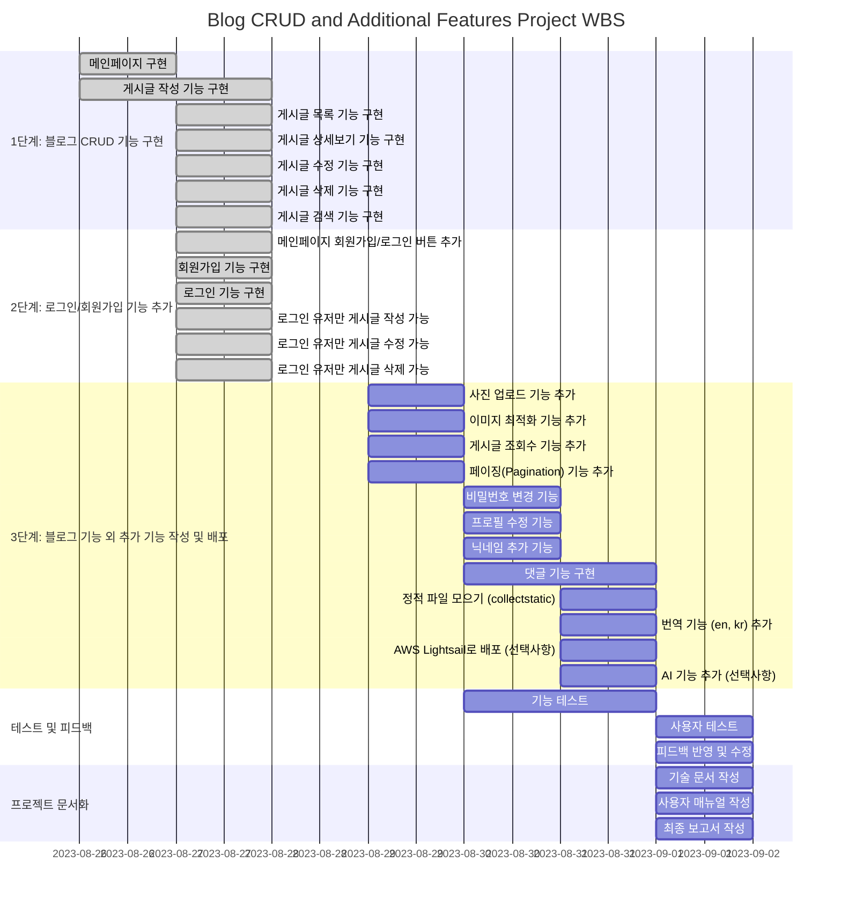

# django_tech_blog
장고 테크 블로그 만들기

# WBS

```mermaid
gantt
    title Blog CRUD and Additional Features Project WBS
    dateFormat  YYYY-MM-DD
    section 1단계: 블로그 CRUD 기능 구현
    메인페이지 구현               :done, 2023-08-26, 1d
    게시글 작성 기능 구현          :done, 2023-08-26, 2d
    게시글 목록 기능 구현          :done, 2023-08-27, 1d
    게시글 상세보기 기능 구현       :done, 2023-08-27, 1d
    게시글 수정 기능 구현          :done, 2023-08-27, 1d
    게시글 삭제 기능 구현          :done, 2023-08-27, 1d
    게시글 검색 기능 구현          :done, 2023-08-27, 1d

    section 2단계: 로그인/회원가입 기능 추가
    메인페이지 회원가입/로그인 버튼 추가 :done, 2023-08-27, 1d
    회원가입 기능 구현               :done, 2023-08-27, 1d
    로그인 기능 구현                 :done, 2023-08-27, 1d
    로그인 유저만 게시글 작성 가능     :done, 2023-08-27, 1d
    로그인 유저만 게시글 수정 가능     :done, 2023-08-27, 1d
    로그인 유저만 게시글 삭제 가능     :done, 2023-08-27, 1d

    section 3단계: 블로그 기능 외 추가 기능 작성 및 배포
    사진 업로드 기능 추가             :2023-08-29, 1d
    이미지 최적화 기능 추가           :2023-08-29, 1d
    게시글 조회수 기능 추가           :2023-08-29, 1d
    페이징(Pagination) 기능 추가      :2023-08-29, 1d
    비밀번호 변경 기능                :2023-08-30, 1d
    프로필 수정 기능                  :2023-08-30, 1d
    닉네임 추가 기능                  :2023-08-30, 1d
    댓글 기능 구현                    :2023-08-30, 2d
    정적 파일 모으기 (collectstatic)  :2023-08-31, 1d
    번역 기능 (en, kr) 추가           :2023-08-31, 1d
    AWS Lightsail로 배포 (선택사항)    :2023-08-31, 1d
    AI 기능 추가 (선택사항)           :2023-08-31, 1d

    section 테스트 및 피드백
    기능 테스트                       :2023-08-30, 2d
    사용자 테스트                     :2023-09-01, 1d
    피드백 반영 및 수정                :2023-09-01, 1d

    section 프로젝트 문서화
    기술 문서 작성                    :2023-09-01, 1d
    사용자 매뉴얼 작성                :2023-09-01, 1d
    최종 보고서 작성                  :2023-09-01, 1d
```
